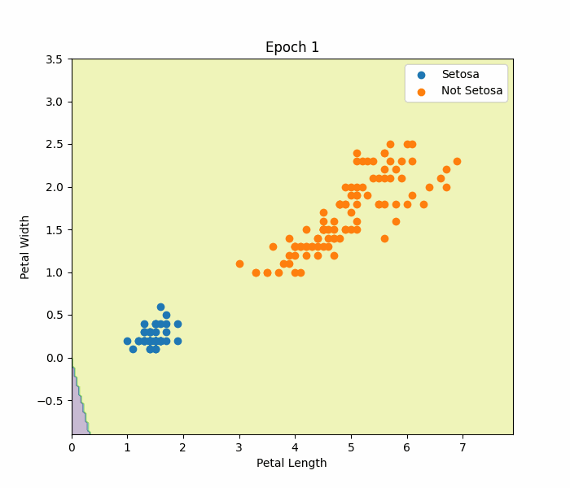

# Perceptron From Scratch

A NumPy implementation of the Perceptron Learning Algorithm.

## Model

\[
z=w^Tx+b
\]

Prediction

\[
f(z)=
\begin{cases}
1,&z\ge0\\
0,&z<0
\end{cases}
\]

## Dataset

- Iris Dataset
- Binary Classification
- Features:
  - Petal Length
  - Petal Width

## Results

Training Accuracy

100%

### Decision Boundary



### Accuracy


## Run

```bash
python train.py
```